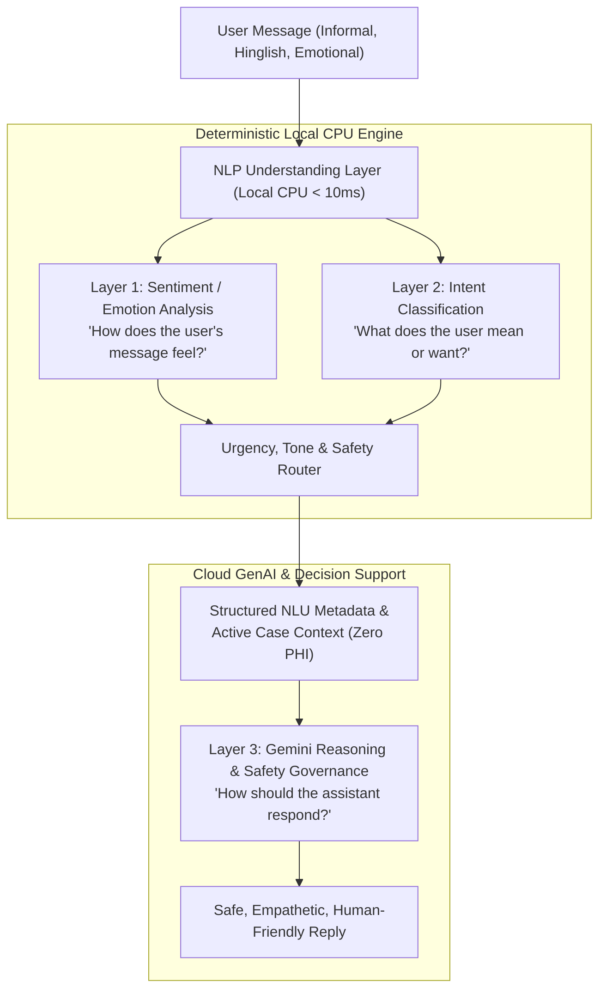

# Multi-Level Uncertainty-Aware (MLUA) Dental Caries Clinical AI

[](https://www.python.org/downloads/)
[](https://fastapi.tiangolo.com/)
[](https://reactjs.org/)
[](https://vitejs.dev/)
[](https://www.typescriptlang.org/)
[](https://pytorch.org/)
[](LICENSE)

> **Clinical Decision Support & Research Platform:** An end-to-end semi-supervised deep learning system for pixel-level dental caries segmentation on panoramic radiographs (Orthopantomograms / OPGs), coupled with a real-time clinical review dashboard and a context-aware Gemini AI explanation assistant.

---

## 1. System Overview & Problem Definition

Dental caries (tooth decay) is the most prevalent chronic non-communicable disease globally. Early detection on panoramic dental radiographs (OPGs) is clinically vital but notoriously challenging due to:
1. **Geometric Distortion & Superimposition:** 15–30% inherent magnification and cervical burnout artifacts at tooth necks that mimic true caries.
2. **Extreme Class Imbalance:** Caries lesions occupy less than $1\%$ of the total panoramic pixel space.
3. **Annotation Scarcity:** Pixel-level expert annotations are labor-intensive, creating a high demand for robust semi-supervised learning (SSL).

This repository implements the **Multi-Level Uncertainty-Aware (MLUA)** framework, extending it with dual BatchNorm buffer-and-parameter Exponential Moving Average (EMA) synchronization, 21-patch sliding-window reconstruction, 4-tier clinical severity staging, and an embedded context-aware Gemini reasoning assistant.

---

## 2. Core Architecture & Methodology

```
+-----------------------------------------------------------------------------------+
|                            Input Panoramic Radiograph                             |
|                              (768 x 1536 Grayscale)                               |
+-----------------------------------------------------------------------------------+
                                         |
                                         v
+-----------------------------------------------------------------------------------+
|                        21 Overlapping Sub-Patches                                 |
|                       (384 x 384, Stride = 192 px)                                |
+-----------------------------------------------------------------------------------+
                                         |
                                         v
+-----------------------------------------------------------------------------------+
|                             ResNet-34 Feature Encoder                             |
|                         Stages: C1 -> C2 -> C3 -> C4 -> C5                        |
+-----------------------------------------------------------------------------------+
                                         |
                                         v
+-----------------------------------------------------------------------------------+
|                         Feature Pyramid Network (FPN)                             |
|                    Lateral Connections & Top-Down Merging                         |
|                         Pyramids: P2, P3, P4, P5 (256 ch)                         |
+-----------------------------------------------------------------------------------+
            |                    |                    |                    |
            v                    v                    v                    v
      +-----------+        +-----------+        +-----------+        +-----------+
      | Aux Head 1|        | Aux Head 2|        | Aux Head 3|        | Aux Head 4|
      | (1/8 Res) |        | (1/4 Res) |        | (1/2 Res) |        | (1/1 Res) |
      | α_1 = 0.1 |        | α_2 = 0.2 |        | α_3 = 0.3 |        | α_4 = 0.4 |
      +-----------+        +-----------+        +-----------+        +-----------+
                                         |
                                         v
+-----------------------------------------------------------------------------------+
|                   Monte Carlo Epistemic Uncertainty Gating                        |
|                     T = 8 Stochastic Passes with Dropout                          |
|             Mean μ(x) & Uncertainty Variance σ²(x) Pseudo-label Gating            |
+-----------------------------------------------------------------------------------+
                                         |
                                         v
+-----------------------------------------------------------------------------------+
|                       2D Gaussian Patch Blending                                  |
|               Reconstructed 768 x 1536 Full Panoramic Mask                        |
|                       Operating Threshold τ = 0.50                                |
+-----------------------------------------------------------------------------------+
                                         |
                                         v
+-----------------------------------------------------------------------------------+
|         FastAPI Decision Support Backend + Context-Aware Gemini Assistant         |
|         (Case Staging, Lesion Localization, PHI Exclusion, PDF Reporting)         |
+-----------------------------------------------------------------------------------+
```

### Key Architectural Pillars
1. **ResNet-34 + FPN Backbone:** Extracts multi-resolution visual features across receptive field hierarchies ($C_1$ through $C_5$) with lateral top-down pyramid merging ($P_2, P_3, P_4, P_5$).
2. **Multi-Scale Deep Supervision:** Four auxiliary prediction heads with weights $\alpha = [0.1, 0.2, 0.3, 0.4]$ enforce strong gradient propagation and sharp enamel border localization.
3. **Synchronized Teacher EMA:** Eliminates numerical instability (such as the NaN collapses documented during earlier iterations) by continuously synchronizing both trainable model parameters ($\beta = 0.999$) and BatchNorm running statistics ($\text{momentum} = 0.05$).
4. **Epistemic Uncertainty Estimation:** $T = 8$ stochastic Monte Carlo dropout passes calculate pixel-level variance $\sigma^2(x)$ to gate unreliable pseudo-labels during semi-supervised consistency regularization.
5. **Overlapping Patch Inference:** High-resolution 21-patch sliding window ($384\times 384\text{ px}$, stride $= 192\text{ px}$) preserves proximal contact anatomy and is reconstructed via smooth 2D Gaussian blending.

---

## 3. Verified Benchmark & Validation Performance

The canonical production and active research checkpoint is **`EXP-MLUA-003_E75_BEST.pth`** (Epoch 75, Global Step 9,900; training run completed at Epoch 78), evaluated on the DC1000 dataset validation cohort at the operational decision threshold $\tau = 0.50$:

| Metric | E75 Validation Score (%) | Exact Value | Preserved E64 Reference | Literature Benchmark | Description |
| :--- | :---: | :---: | :---: | :---: | :--- |
| **Dice Similarity (DSC)** | **`71.87%`** | `0.71867` | `69.39%` (+2.48 pp) | `71.12%` (+0.75 pp) | Spatial overlap across suspected caries contours |
| **Intersection over Union (IoU)** | **`57.35%`** | `0.57349` | `54.33%` (+3.02 pp) | - | Jaccard index over foreground lesion pixels |
| **Precision (PPV)** | **`78.13%`** | `0.78132` | `74.69%` (+3.44 pp) | - | True positive ratio among predicted positives |
| **Recall (Sensitivity)** | **`67.34%`** | `0.67343` | `66.42%` (+0.92 pp) | - | Demineralization capture across ground-truth regions |
| **Specificity (TNR)** | **`99.82%`** | `0.99824` | `99.78%` (+0.04 pp) | - | True negative rate across sound background tooth structure |
| **Validation Loss** | **`0.7254`** | `0.72540` | `0.7471` (-0.0217) | - | Combined BCE + Soft Dice objective at peak epoch |
| **Zero-Prediction Ratio** | **`2.0%`** | `0.02000` | `0.0%` | - | Non-pathological / sound background calibration |

> **Checkpoint Distinctions:**
> - **Current Canonical Active Checkpoint:** `EXP-MLUA-003_E75_BEST.pth` (Epoch 75 of 78 epochs completed; validation loss 0.7254; validation Dice 71.867%; exceeds 71.12% literature benchmark by +0.747 pp).
> - **Historical Preserved Checkpoint:** `EXP-MLUA-003_E64_BEST.pth` (Epoch 64 of 70 epochs run; validation loss 0.7471; validation Dice 69.386%). Preserved for reproducibility and comparative analysis.
> - **Historical Baseline Checkpoint:** `EXP-MLUA-003_E56_FINAL.pth` (Epoch 56 of 60 epochs run; validation loss 0.7639; validation Dice 65.623%). Preserved in `checkpoints/` for historical baseline verification.
> - **Final Sealed-Test Evaluation (100 independent cases):**
>   - **Macro Metrics:** Dice `50.15%` (0.50147), IoU `36.61%` (0.36607), Precision `59.89%` (0.59889), Recall `48.08%` (0.48077), Specificity `99.87%` (0.99872), F1 `50.15%`, Zero-pred cases: 0/100 (`0.0%`).
>   - **Micro Metrics:** Dice `52.92%` (0.52924), IoU `35.98%` (0.35984), Precision `61.54%` (0.61540), Recall `46.42%` (0.46424), Specificity `99.87%` (0.99872), F1 `52.92%`.
>   - **Generalization Gap:** Validation-to-test Dice gap of -21.720 percentage points (strictly labeled as *Final Sealed-Test Evaluation*, not clinical validation).

---

## 4. Gemini Clinical Assistant & Governance

The application integrates an embedded context-aware AI Assistant powered by Google GenAI (Gemini 2.5 Flash), specifically engineered for radiologic decision support:

```
User Query ("What is the stage of this recent report?")
                      |
                      v
       FastAPI Backend /api/chat Router
                      |
                      v
       Case Context Sanitizer & Builder
  (Extracts Candidate Regions, FDI Teeth, Area %,
   Heuristic Staging; Strictly Strips all PHI/PII)
                      |
                      v
       Gemini Intent Router & Reasoning Engine
  [CASE LOCATION] -> FDI tooth, quadrant, bbox, area px
  [CASE STAGING]  -> Application-defined Level 1/2/3 staging
  [CASE FINDINGS] -> Segmented radiolucency & probability
  [TECHNICAL]     -> MLUA architecture, FPN, Dice benchmarks
  [SAFETY]        -> Medical disclaimer & non-autonomous guard
                      |
                      v
  Gemini Live Response / SSE Stream / Grounded Clinical Fallback
```

### Medical Safety & Governance Policies
- **No Autonomous Diagnosis:** The AI does not diagnose disease or prescribe medications. All outputs are explicitly defined as algorithmic decision-support findings requiring licensed dental verification.
- **Model-Predicted Probability Terminology:** Neural network outputs are defined as mathematical sigmoid activation values over segmented pixels, never as "clinical certainty" or "diagnostic probability."
- **Application-Defined Heuristic Staging:** Severity levels (Stage 0: Normal, Level 1: Suspected Early Caries, Level 2: Moderate Caries, Level 3: Extensive Dentinal Caries) are heuristic classifications derived from lesion pixel area and depth indicators.
- **Zero-PHI Guarantee:** Patient names, IDs, pseudo-identifiers (e.g. `PT-9502`), filenames, and metadata are excluded from prompts sent to external AI endpoints.

---

## 5. Natural Language Understanding & Conversational Intelligence

The embedded Clinical AI Assistant is powered by an additive three-layer Natural Language Understanding (NLU) architecture that mediates between informal human communication, emotional states, and technical radiograph findings:



### Component Roles & System Boundaries
- **Local NLP Engine:** Fast, deterministic scikit-learn TF-IDF vector space classifier with typo-normalization, colloquial English lexicon, and Hinglish semantic mapping running locally on CPU in $<10\text{ ms}$. Zero external dependencies for intent/emotion categorization.
- **Deterministic Application Logic:** Enforces high-priority safety guards (blocking autonomous diagnosis, medication prescribing, or invasive treatment), serializes active case findings, and guarantees strict Zero-PHI isolation.
- **Gemini LLM Reasoning:** Powered by `gemini-2.5-flash` via the official Google GenAI Interactions & Models API. Synthesizes natural-language explanations, adapts communicative tone, acknowledges user emotions empathetically, and respects medical boundaries.
- **MLUA Segmentation Model:** Pure PyTorch dual-network engine (`EXP-MLUA-003_E75_BEST.pth`, $\tau=0.50$, 21-patch reconstruction) acting as the sole objective source of truth for pixel-level radiolucency detection.

### The Three Understanding Layers
1. **Sentiment / Emotion Analysis (*"How does the text feel?"*):**
   Categorizes 11 affective states: `neutral`, `positive`, `confused`, `anxious`, `worried`, `fearful`, `frustrated`, `sad`, `curious`, `relieved`, `urgent/concerned`.
   *Note: Emotion confidence is strictly linguistic model confidence, never clinical confidence or disease severity.*
2. **Intent Classification (*"What does the user mean or want?"*):**
   Resolves 29 semantic intents across Case-Specific (`lesion_location`, `findings`, `staging`, `stage_explanation`, `highlighted_region`, `tooth_information`, `severity_explanation`, `model_probability`, `report_summary`), Technical (`model_metrics`, `model_architecture`, `mlua_methodology`, `uncertainty_explanation`, `segmentation_explanation`, `threshold_explanation`, `inference_pipeline`), General Conversation (`greeting`, `casual_conversation`, `clarification`, `general_question`, `thanks`, `goodbye`), and Medical Safety (`diagnosis_request`, `treatment_request`, `medication_request`, `emergency_or_urgent_concern`, `definitive_clinical_claim`).
3. **Gemini LLM Reasoning (*"How should the assistant respond?"*):**
   Receives structured `CURRENT USER LANGUAGE ANALYSIS` metadata block to adapt conversational style (calm, reassuring without false reassurance, objective, educational) while strictly upholding non-diagnostic clinical boundaries.

---

## 6. Technology Stack

### Frontend
- **Framework:** React 18.3 + TypeScript + Vite 5.4
- **Styling:** Tailwind CSS + Vanilla CSS Variables (Dark/Light Clinical Modes)
- **Icons & UI:** Lucide React, HTML5 Canvas Overlay Rendering
- **Reporting:** Vector-grade PDF & JSON Clinical Report Generators (`html2canvas`, `jspdf`)

### Backend & NLP
- **Framework:** FastAPI (Python 3.10+) + Uvicorn
- **NLU Engine:** Scikit-learn TF-IDF semantic vector classifier + Emotion Engine (11 states, 29 intents)
- **AI Integration:** Official Google GenAI SDK (`google-genai` Interactions & Models API)
- **Inference Engine:** PyTorch 2.0+ (ResNet-34, FPN, Sliding-Window Reconstructor)

---

## 7. Project Structure

```text
MLUA/
├── .env.example                               # Environment configuration template
├── .gitignore                                 # Git exclusions (strictly ignores .env)
├── CODE_OF_CONDUCT.md                         # Community conduct standards
├── CONTRIBUTING.md                            # Contribution workflow
├── LICENSE                                    # MIT License
├── README.md                                  # Main repository documentation
├── SECURITY.md                                # Security & vulnerability disclosure policy
├── requirements.txt                           # Python dependencies
│
├── backend/                                   # FastAPI Backend, NLU Engine & Gemini Assistant
│   ├── __init__.py
│   ├── gemini_service.py                      # Context-aware Gemini Assistant service
│   ├── main.py                                # API route handlers & inference integration
│   ├── test_chat_api.py                       # 65-point automated verification suite + benchmark
│   └── nlp/                                   # 3-Layer NLU Conversational Intelligence Module
│       ├── __init__.py
│       ├── emotion_analyzer.py                # Layer 1: Multi-class emotion & sentiment engine
│       ├── intent_classifier.py               # Layer 2: 31-class semantic intent engine with safety guards
│       ├── nlu_router.py                      # Layer 3: Unified tone, urgency & context router
│       ├── schemas.py                         # Pydantic v2 schemas for NLU metadata
│       ├── build_conversational_500_dataset.py# 500-row conversational dataset builder
│       ├── validate_conversational_dataset.py # Automated 11-field dataset integrity validator
│       ├── evaluate_conversational_qa.py      # Benchmark evaluation engine & confusion matrix exporter
│       ├── data/                              # Certified NLU benchmarks (500-row QA + 250-row intent)
│       └── models/                            # Trained local NLU scikit-learn models
│
├── frontend/                                  # React + Vite + TypeScript Application
│   ├── index.html
│   ├── package.json
│   ├── vite.config.ts
│   ├── public/
│   │   ├── favicon.svg
│   │   └── samples/                           # Reference OPG images & ground-truth masks
│   └── src/
│       ├── App.tsx
│       ├── index.css
│       ├── components/                        # UI Components (Drawer, Tables, Modals, MarkdownRenderer)
│       ├── constants/                         # clinicalMetadata.ts (Canonical E75 Source of Truth)
│       ├── context/                           # AIChatContext.tsx & ThemeContext.tsx
│       ├── data/                              # mockData.ts (E75-aligned test cases)
│       ├── pages/                             # Clinical Review, Verification, Methodology, FAQ
│       ├── services/                          # API client, PDF generator & fallback logic
│       ├── types/                             # TypeScript interfaces
│       └── utils/                             # Mask generation & storage utilities
│
├── src/mlua/                                  # Core PyTorch Segmentation Pipeline
│   ├── data/                                  # Dataset loaders & patch extractors
│   ├── engine/                                # Teacher-Student trainers & EMA synchronizers
│   ├── evaluation/                            # 21-patch sliding-window reconstructor & metrics
│   └── models/                                # ResNet-34, FPN, and Monte Carlo dropout heads
│
├── checkpoints/                               # Checkpoints Registry & Provenance
│   └── README.md                              # Checkpoint registry pointing to canonical paths
│
├── configs/                                   # Configuration YAMLs
│   ├── mlua_default_config.yaml
│   ├── evaluation/sealed_test_100_config.yaml
│   └── experiments/                           # exp_002, exp_003, ablation, and mc_sampling configs
│
├── docs/                                      # Technical & Clinical Documentation
│   ├── README.md                              # Master Documentation Index & TOC
│   ├── ARCHITECTURE.md                        # Mathematical formulation & system diagrams
│   ├── API_AND_FRONTEND.md                    # Detailed API endpoints & React architecture
│   ├── CLINICAL_GUIDELINES.md                 # Clinical safety, limitations & governance
│   ├── EXPERIMENTS.md                         # Complete benchmark & training run logs
│   ├── FINAL_PROJECT_REPORT.md                # Comprehensive technical project report
│   ├── NLU_CONVERSATIONAL_DATASET.md          # 500-row conversational benchmark specification
│   ├── NLU_DATASET_AND_CLASSIFIER.md          # 3-layer NLU architecture & intent taxonomy
│   ├── RESEARCH_PAPER_AUDIT.md                # Paper-direct vs engineering feature audit
│   └── research/                              # Dataset & mentor preparation audits
│
├── outputs/                                   # Diagnostics, Experiment Checkpoints & Figures
│   ├── diagnostics/                           # Historical milestone & stability audits, confusion matrix
│   ├── evaluation/                            # Final 100 sealed test and lesion scale metrics
│   ├── experiments/                           # Experiment runs (EXP-001, EXP-002, EXP-003 checkpoints & logs)
│   │   ├── EXP-MLUA-001_HISTORICAL/checkpoints/ # EXP-MLUA-001_BEST.pth (Supervised baseline)
│   │   └── EXP-MLUA-003_FINAL/checkpoints/      # EXP-MLUA-003_E75_BEST.pth (Active canonical model)
│   ├── progress_figures/                      # Workflow diagrams & metric charts
│   └── report_figures/                        # High-resolution publication figures
│
├── research_archive/                          # Historical Artifacts & Research Scripts
│   ├── README.md                              # Research archive index and provenance
│   ├── reports/                               # Literature paper & capstone progress reports
│   └── scripts/                               # PDF builders, figure generators & forensic tools
│
├── evaluate/                                  # Image I/O & evaluation utilities
├── util/                                      # Loss functions & consistency weight schedules
└── scratch/                                   # Ephemeral scratch space policy
    └── README.md
```

---

## 7. Installation & Quick Start

### Prerequisites
- **Python:** 3.10 or higher
- **Node.js:** 18.0 or higher
- **Package Managers:** `pip` and `npm`

### Step 1: Clone Repository & Setup Environment
```bash
git clone https://github.com/nupurmadaan04/dental-caries.git
cd dental-caries

# Copy environment template
cp .env.example .env
```

Configure your `.env` file with your Gemini API key (optional for local fallback mode):
```env
GEMINI_API_KEY=your_gemini_api_key_here
GEMINI_MODEL=gemini-2.5-flash
HOST=127.0.0.1
PORT=8000
```

### Step 2: Backend Setup
```bash
# Install Python dependencies
pip install -r requirements.txt

# Run preflight verification (validates checkpoint presence, SHA-256 integrity, NLU models)
python verify_environment.py

# Start FastAPI backend server
uvicorn backend.main:app --host 127.0.0.1 --port 8000 --reload
```
The backend will be available at `http://127.0.0.1:8000`. API documentation is hosted at `http://127.0.0.1:8000/docs`.

### Step 3: Frontend Setup
In a new terminal:
```bash
cd frontend

# Install Node dependencies
npm install

# Start Vite development server
npm run dev
```
The Clinical UI will be accessible at `http://localhost:5173`.

---

## 8. API Reference

| Method | Endpoint | Description |
| :--- | :--- | :--- |
| `GET` | `/api/health` | Service health status, model checkpoint info, and Gemini status |
| `POST` | `/api/chat` | Multi-turn case-aware AI chat with dynamic context injection |
| `POST` | `/api/chat/stream` | Real-time Server-Sent Events (SSE) streaming chat |
| `POST` | `/api/chat/clear` | Purges conversation history and resets session state |
| `POST` | `/api/analyze` | Executes MLUA inference on uploaded panoramic X-rays |
| `GET` | `/api/history` | Retrieves patient radiograph analysis records |
| `GET` | `/api/history/{id}` | Retrieves detailed findings for a specific analysis |
| `GET` | `/api/reports/{id}/pdf` | Generates a 2-page vector clinical PDF report |
| `GET` | `/api/reports/{id}/json`| Exports raw segmentation coordinates and metadata |

---

## 9. Automated Testing & Verification

Run the comprehensive 65-point test suite covering metric alignment, NLU intent and emotion routing, multi-turn conversation flow, bilingual topic preservation, safety guard enforcement, and model immutability:

```bash
# Run complete 65-point test suite
pytest backend/test_chat_api.py -v
```

### Production Build Verification
```bash
cd frontend
npm run build
```
Confirms clean TypeScript compilation and static asset generation with zero errors.

---

## 10. Clinical Disclaimer & Limitations

> [!IMPORTANT]
> **FOR CLINICAL DECISION SUPPORT & RESEARCH PURPOSES ONLY.**  
> The MLUA Dental Caries Clinical AI is not an autonomous diagnostic medical device. It is designed to assist qualified dental practitioners by highlighting candidate areas of radiographic radiolucency. Final diagnostic decisions, caries classifications, and restorative treatment plans must be made by a licensed dentist following visual-tactile examination, vitality assessments, and clinical correlation.

---

## 11. License & Citation

This project is licensed under the [MIT License](LICENSE).

```bibtex
@article{mlua_dental_caries_2026,
  title={Multi-Level Uncertainty-Aware Semi-Supervised Dental Caries Segmentation on Panoramic Radiographs},
  author={Dental AI Research Team},
  year={2026},
  journal={Clinical Radiology & Artificial Intelligence}
}
```
