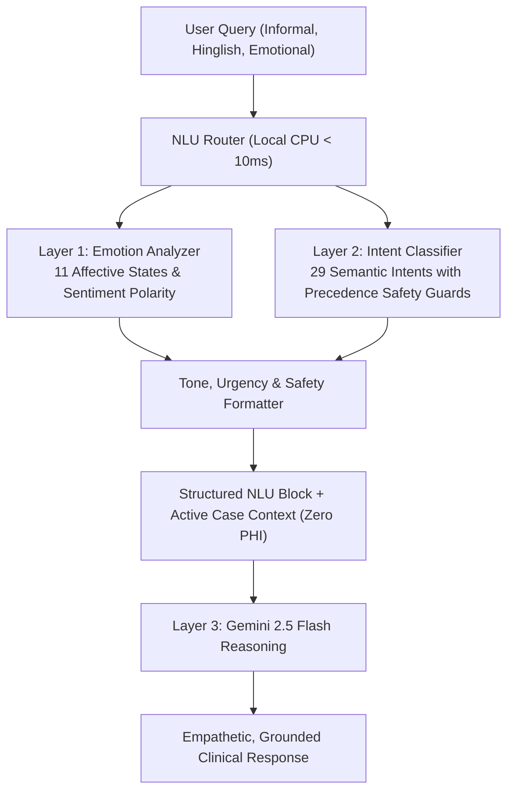

# API Endpoints & Frontend Architecture Documentation

This document describes the current frontend client architecture, React state management, FastAPI backend services, context-aware Gemini integration, and clinical reporting workflows.

---

## 1. Frontend Route Specifications

The application uses client-side routing with comprehensive dark/light clinical theme support:

| Route Path | Page Component | Functional Purpose |
| :--- | :--- | :--- |
| `/` | `DashboardPage.tsx` | High-level clinical screening dashboard, recent case history, and quick metrics overview. |
| `/new-analysis` | `NewAnalysisPage.tsx` | Drag-and-drop panoramic X-ray (OPG) upload, DICOM/PNG ingestion, and inference trigger. |
| `/analysis/:id` | `AnalysisResultPage.tsx` | High-resolution canvas viewer, segmentation overlay opacity slider, FDI lesion table, and AI Assistant integration. |
| `/history` | `HistoryPage.tsx` | Longitudinal patient analysis history with search, filtering, and status badges. |
| `/reports` | `ReportsPage.tsx` | Clinical PDF and JSON report generation, export, and preview interface. |
| `/verification`| `TechnicalVerificationPage.tsx` | Canonical E75 benchmark validation metrics, threshold parameters, research disclosures, and preserved historical E64 comparison. |
| `/methodology` | `MLUAMethodologyPage.tsx` | Detailed technical documentation of Teacher-Student FPN, EMA synchronization, and uncertainty gating. |
| `/limitations` | `LimitationsPage.tsx` | Disclosures regarding cervical burnout, magnification distortion, and decision-support boundaries. |
| `/faq` | `FAQPage.tsx` | Clinician and patient FAQs explaining terminology, Dice scores, and workflow best practices. |
| `/settings` | `SettingsPage.tsx` | Operational threshold configuration, model checkpoint info, and API status monitoring. |

---

## 2. React Components & State Management

### Key Components (`frontend/src/components/`)
- **`AIAssistantDrawer.tsx`:** Flyout drawer for the Gemini Assistant. Features prompt suggestions (*"Explain this X-ray result"*, *"What does Level 2 indicate?"*), streaming message rendering, explanation mode toggles (*Standard*, *Simple*, *Technical*), and safe non-identifying opening messages.
- **`LesionTable.tsx`:** Interactive tabular summary of segmented candidate regions, listing Region ID ($L_1, L_2$), FDI Tooth notation, anatomical location, depth indicator, pixel area, and model-predicted probability.
- **`ImageLightboxModal.tsx`:** Full-screen high-resolution radiograph inspection modal with zoom, pan, and mask toggle capabilities.
- **`StagingBadge.tsx` / `ClinicalStatusBadge.tsx`:** Visual badges reflecting the 4-tier heuristic severity levels.
- **`Navbar.tsx` & `Sidebar.tsx`:** Navigation bar with theme toggle, backend health monitor, and drawer controls.

### Application Contexts (`frontend/src/context/`)
1. **`AIChatContext.tsx`:**
   - Manages active analysis result state (`activeAnalysis`).
   - Handles drawer open/close transitions (`isDrawerOpen`).
   - Stores user-selected explanation mode (`standard`, `simple`, `technical`).
   - Tracks unique session IDs with automated cache invalidation upon case switching.
2. **`ThemeContext.tsx`:**
   - Toggles clinical light/dark UI themes, persisting preferences in local browser storage.

---

## 3. Backend API Endpoints (FastAPI)

The backend is built with FastAPI and runs on `http://127.0.0.1:8000`.

### Health & Diagnostics
#### `GET /api/health`
Returns service availability, active checkpoint metadata, and Gemini connection status.
- **Response `200 OK`:**
  ```json
  {
    "status": "ONLINE",
    "version": "2.4.0",
    "model_checkpoint": "EXP-MLUA-003_E75_BEST.pth",
    "selected_epoch": 75,
    "completed_training_epochs": 78,
    "operating_threshold": 0.50,
    "gemini_assistant": {
      "configured": true,
      "model": "gemini-2.5-flash",
      "status": "READY"
    }
  }
  ```

---

### Context-Aware Gemini AI Chat
#### `POST /api/chat`
Executes multi-turn clinical chat with dynamic case context injection.
- **Request Body:**
  ```json
  {
    "message": "What is the stage of this recent report?",
    "session_id": "session_1788912345",
    "mode": "standard",
    "case_context": {
      "model": {
        "name": "MLUA",
        "checkpoint": "EXP-MLUA-003_E75_BEST.pth",
        "threshold": 0.50
      },
      "case": {
        "image_available": true,
        "overall_finding": "SUSPECTED EARLY CARIES",
        "application_staging": {
          "level": "Level 1",
          "title": "Suspected Early Caries",
          "description": "Demineralization limited to enamel or outer dentin border"
        },
        "findings": [
          {
            "lesionNumber": "L1",
            "toothNumberFDI": "24",
            "anatomicalLocation": "Upper Left",
            "cariesDepthIndicator": "Enamel",
            "modelPredictedProbability": 0.82
          }
        ]
      }
    }
  }
  ```
- **Response `200 OK`:**
  ```json
  {
    "text": "The current report assigns this candidate region an application-defined Level 1 heuristic stage (Suspected Early Caries)...",
    "session_id": "session_1788912345",
    "status": "success",
    "model": "gemini-2.5-flash"
  }
  ```

#### `POST /api/chat/stream`
Provides real-time token streaming using Server-Sent Events (SSE) for smooth conversational rendering.

#### `POST /api/chat/clear`
Purges memory and session state for the provided `session_id`.

---

### Radiograph Analysis & Case Ingestion
#### `POST /api/analyze`
Receives an uploaded panoramic image file (`multipart/form-data`) and executes MLUA patch segmentation and heuristic staging.
- **Response `200 OK`:** Returns structured `AnalysisResult` object containing candidate lesion coordinates, bounding boxes, pixel areas, model-predicted probabilities, and binary mask URLs.

#### `GET /api/history`
Returns paginated list of previously analyzed clinical cases.

#### `GET /api/history/{id}`
Returns full detailed analysis payload for a specific case identifier.

---

### Clinical Reporting & Export
#### `GET /api/reports/{id}/pdf`
Generates a downloadable vector 2-page PDF radiology report with embedded radiograph overlays and metrics.

#### `GET /api/reports/{id}/json`
Exports machine-readable JSON containing raw lesion pixel coordinates and metadata.

---

## 4. Privacy & Case Isolation Protocol

1. **Client-Side Sanitization:** The frontend `buildCaseContext()` utility strips all patient identifiers, names, phone numbers, and filenames before constructing API payloads.
2. **Deterministic Case Signatures:** The backend computes a deterministic fingerprint of findings. If a user switches cases in the same browser session, the server automatically flushes previous conversational memory to prevent cross-case context leakage.
3. **Grounded Offline Fallback:** If the Gemini API key is unset or external endpoints encounter rate limits (429), both backend and frontend fall back to grounded, deterministic rule-based responses matching the active case's actual findings.

---

## 5. Natural Language Understanding & Conversational Intelligence

The backend implements an additive three-layer NLU system:



### Three-Layer Structure
1. **Layer 1: Sentiment / Emotion Analysis (*"How does the user's message feel?"*):**
   - Classifies message into 11 fine-grained emotions: `neutral`, `positive`, `confused`, `anxious`, `worried`, `fearful`, `frustrated`, `sad`, `curious`, `relieved`, `urgent/concerned`.
   - Distinguishes linguistic confidence from clinical confidence (labeled strictly as *"emotion classification confidence"*).
2. **Layer 2: Intent Classification (*"What does the user mean or want?"*):**
   - Classifies user objective across 29 intents in four main categories: Case-Specific, Model/Technical, General Conversation, and Medical Safety.
   - Enforces high-priority safety guards for definitive diagnosis, medication, treatment, and emergency queries.
3. **Layer 3: LLM Reasoning (*"How should the assistant respond?"*):**
   - Injects the `CURRENT USER LANGUAGE ANALYSIS` block into Gemini system instruction.
   - Adapts tone (calm, reassuring, objective, educational) to user emotions without offering false clinical reassurance or crossing non-diagnostic medical boundaries.

