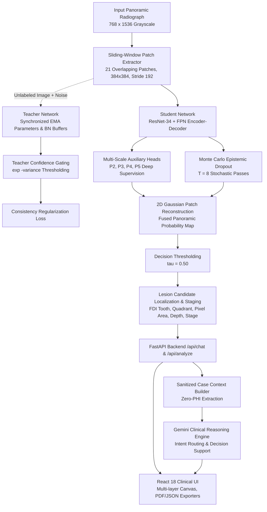

# MLUA System Architecture & Mathematical Foundations

This document provides the canonical architectural specification, mathematical derivations, and data-flow interactions for the **Multi-Level Uncertainty-Aware (MLUA)** Dental Caries Segmentation and Clinical AI platform.

---

## 1. End-to-End System Architecture



---

## 2. Multi-Scale Deep Supervision & Feature Pyramid Network

To mitigate gradient vanishing across deep residual stages and capture subtle, low-contrast early enamel demineralization (E1), the architecture integrates a **ResNet-34** backbone with a **Feature Pyramid Network (FPN)** decoder yielding lateral feature maps $P_2, P_3, P_4, P_5$:

$$\mathcal{L}_{\text{sup}} = \sum_{k=1}^{4} \alpha_k \left[ \mathcal{L}_{\text{BCE}}(P_k, Y) + \mathcal{L}_{\text{SoftDice}}(P_k, Y) \right]$$

where:
- $\alpha = [0.1, 0.2, 0.3, 0.4]$ progressively emphasizes full-resolution spatial detail at $P_2$.
- $P_k$ denotes the predicted probability activation at pyramid level $k$.
- $Y$ is the ground-truth binary caries segmentation mask downsampled to the matching spatial scale.

### Soft Dice Loss Formulation
Due to severe foreground sparsity ($< 1\%$ caries pixel density), Soft Dice loss directly optimizes contour spatial overlap:

$$\mathcal{L}_{\text{SoftDice}}(P, Y) = 1 - \frac{2 \sum_{i} P_i Y_i + \epsilon}{\sum_{i} P_i^2 + \sum_{i} Y_i^2 + \epsilon}$$

where $\epsilon = 10^{-6}$ ensures numerical stability.

---

## 3. Semi-Supervised Consistency & Synchronized Teacher EMA

For unlabeled dental radiographs $U$, the Student network $f(x; \theta)$ is regularized against the predictions of a momentum Teacher network $f(\tilde{x}; \theta_{\text{ema}})$:

$$\mathcal{L}_{\text{unsup}} = \frac{1}{|U|} \sum_{x \in U} \exp(-\sigma^2(x)) \cdot \| f(x; \theta) - f(\tilde{x}; \theta_{\text{ema}}) \|_2^2$$

### Dual Parameter & BatchNorm Buffer Synchronization
During initial development (EXP-MLUA-002), parameter-only EMA caused severe running mean/variance drift in the Teacher network, precipitating numerical overflow and NaN loss collapse. The remediated framework enforces strict, synchronous dual updates:

$$\theta_{\text{ema}} \leftarrow \beta \theta_{\text{ema}} + (1 - \beta) \theta$$
$$\mu_{\text{running\_ema}} \leftarrow \beta \mu_{\text{running\_ema}} + (1 - \beta) \mu_{\text{running}}$$
$$\sigma^2_{\text{running\_ema}} \leftarrow \beta \sigma^2_{\text{running\_ema}} + (1 - \beta) \sigma^2_{\text{running}}$$

where $\beta = 0.999$ and BatchNorm momentum is configured to $0.05$.

---

## 4. Monte Carlo Epistemic Uncertainty Estimation

Ambiguities resulting from anatomical cervical burnout, restorative composite edges, and geometric OPG distortions are captured via $T = 8$ stochastic Monte Carlo forward passes with active dropout ($p = 0.20$):

$$\mu(x) = \frac{1}{T} \sum_{t=1}^{T} \hat{y}_t(x)$$

$$\sigma^2(x) = \frac{1}{T} \sum_{t=1}^{T} \left( \hat{y}_t(x) - \mu(x) \right)^2$$

During unsupervised consistency learning, high variance regions ($\sigma^2(x) \gg 0$) down-weight consistency penalty through $\exp(-\sigma^2(x))$, preventing erroneous pseudo-label reinforcement.

---

## 5. 21-Patch Sliding-Window Inference & 2D Gaussian Blending

To prevent resolution loss from downsampling full-size $768 \times 1536$ radiographs:
1. **Patch Grid:** 21 overlapping sub-patches of size $384 \times 384\text{ px}$ extracted with a fixed stride of $192\text{ px}$ (3 vertical rows $\times$ 7 horizontal columns).
2. **2D Gaussian Fusion:** Overlapping patch margins are smoothly blended using a 2D Gaussian weighting matrix $W(u, v)$ to eliminate seam boundary artifacts:
   $$W(u, v) = \exp\left( -\frac{(u - c_u)^2 + (v - c_v)^2}{2 \sigma_{\text{patch}}^2} \right)$$
3. **Thresholding:** Reconstructed probabilities are binarized at $\tau = 0.50$, forming discrete candidate carious regions.

---

## 6. Clinical Decision-Support & Staging Architecture

Segmentation masks are converted into actionable clinical findings:
- **Candidate Region Extraction:** Connected-component labeling identifies discrete lesion zones ($L_1, L_2, \dots$).
- **FDI Tooth Mapping:** Coordinate bounding boxes map candidate regions to international FDI tooth notations (e.g. Tooth 24, Tooth 46).
- **Depth Indication:** Radiolucency depth is heuristic-categorized as *Enamel* (superficial) or *Dentin* (deep).
- **4-Tier Heuristic Severity Staging:**
  - **Stage 0 (Normal):** No suspicious radiolucent regions detected above $\tau = 0.50$.
  - **Level 1 (Suspected Early Caries):** Superficial demineralization confined to enamel or outer dentin border.
  - **Level 2 (Moderate Caries):** Demineralization extending past the enamel-dentin junction into middle dentin.
  - **Level 3 (Extensive Dentinal Caries):** Deep radiolucency approaching or involving pulp borders.

---

## 7. Context-Aware Gemini AI Integration & Safety Governance

The FastAPI backend injects the sanitized active case context into Gemini's system instructions:

```
CURRENT ANALYZED CASE
---------------------
Candidate sites: L1 (Tooth 24) in Upper Left
Region details:
  * Region: L1, Tooth: 24, Position: Upper Left, Depth: Enamel, Area: 96 px (0.22%), Model Predicted Probability: 82.0%, Heuristic Staging: Level 1
Segmentation findings: Overall Finding: SUSPECTED EARLY CARIES; Total Candidate Regions: 1; Affected Area: 0.22% (96 px)
Model Predicted Probability: 82.0% (mean across segmented candidate pixels above threshold tau = 0.50)
Application-Defined Heuristic Staging: Level 1 - Suspected Early Caries
---------------------
END CURRENT ANALYZED CASE
```

### Intent Routing Table
| Intent Category | Trigger Query Patterns | Routing Behavior |
| :--- | :--- | :--- |
| **CASE LOCATION** | *"Where is the lesion?", "Which tooth is affected?", "What does L1 mean?"* | Uses active candidate region ID, FDI tooth, quadrant, and pixel coordinates. |
| **CASE STAGING** | *"What is the stage of this report?", "What does Level 2 indicate?"* | Returns application-defined heuristic stage and depth description with clinical disclaimer. |
| **CASE FINDINGS** | *"What did the model find?", "Explain this X-ray result"* | Summarizes candidate regions, total area %, and model predicted probability. |
| **TECHNICAL** | *"How does MLUA work?", "What is Dice score?"* | References ResNet-34 + FPN architecture and E64 validation benchmarks. |
| **SAFETY** | *"Do I definitely have caries?", "Should I take medicine?"* | Enforces non-autonomous disclaimer and directs patient to in-person clinical exam. |

### Privacy & PHI Hardening
- Zero patient names, medical record numbers, pseudo-identifiers, phone numbers, or file paths are ever transmitted in API payloads.
- Local session history is purged automatically upon switching cases to guarantee strict inter-case isolation.
