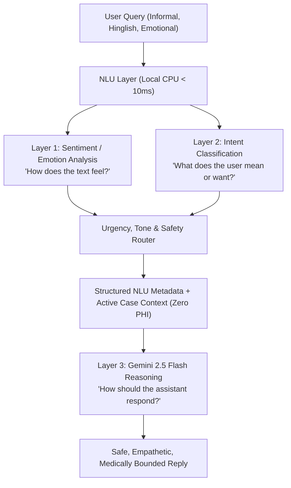

# Clinical Safety Guidelines & Regulatory Disclosures

This document outlines the clinical governance standards, terminology definitions, intended use parameters, and radiologic limitations for the **MLUA Dental Caries Clinical AI** system.

---

## 1. Intended Use & Regulatory Classification

> [!IMPORTANT]
> **INVESTIGATIONAL & CLINICAL DECISION SUPPORT ONLY.**  
> The MLUA Dental Caries Clinical AI is intended solely as an adjunctive decision-support aid for licensed dental practitioners and radiologic researchers. It is **NOT** an autonomous diagnostic medical device and must never be utilized as a sole basis for therapeutic or surgical dental intervention.

### Primary Clinical Functions
- **Radiolucency Localization:** Algorithmically flags candidate pixel zones exhibiting relative radiolucency on panoramic dental radiographs (OPGs).
- **Candidate Region Segmentation:** Highlights spatial contours of suspected proximal and occlusal demineralization at operational threshold $\tau = 0.50$.
- **Heuristic Categorization:** Categorizes detected lesions into application-defined severity tiers (Level 1, Level 2, Level 3) to guide clinical prioritization.

---

## 2. Core Terminology & Distinction of Concepts

To prevent clinical misinterpretation, the system strictly enforces the following conceptual distinctions:

### 1. Model Output vs. Clinical Diagnosis
- **Model Output:** Mathematical binary pixel segmentation ($0 = \text{background/sound tissue}$, $1 = \text{suspected demineralization}$) indicating areas where neural network activation exceeds $\tau = 0.50$.
- **Clinical Diagnosis:** Definitive diagnostic determination made exclusively by a licensed dental practitioner following comprehensive in-person visual-tactile examination, periodontal probing, pulp vitality assessment, and patient history review.

### 2. Model-Predicted Probability vs. Clinical Confidence
- **Model-Predicted Probability:** Continuous sigmoid activation value $\sigma(z) \in [0, 1]$ generated by the neural network's final layer across candidate pixel patches.
- **Clinical Meaning:** Model-predicted probability represents the algorithmic pattern-matching score for radiographic radiolucency. **It does NOT represent the probability that a patient clinically has dental caries.**

### 3. Application-Defined Heuristic Staging
Staging tiers are heuristic rule-based categories derived from segmented pixel areas and radiographic depth indicators:
- **Stage 0 (Normal / Low Risk):** No suspicious radiolucent candidate regions detected above threshold $\tau = 0.50$.
- **Level 1 (Suspected Early Caries):** Demineralization confined to enamel or the superficial dentino-enamel junction. In non-cavitated lesions, remineralization therapy and fluoride varnish monitoring are typically evaluated.
- **Level 2 (Moderate Caries):** Radiolucency extending past the enamel-dentin junction into middle/deep dentin. Restorative evaluation and cavity preparation are typically considered.
- **Level 3 (Extensive Dentinal Caries):** Deep radiolucency in close proximity to the dental pulp. Immediate vitality testing and endodontic/restorative consultation are advised.

---

## 3. Known Radiologic & Algorithmic Limitations

Panoramic dental radiography (OPG) possesses inherent physical and optical characteristics that impact algorithmic segmentation:

### 1. Cervical Burnout Artifacts
Cervical burnout is a frequent optical phenomenon occurring at the tooth neck (between the dense enamel crown and the alveolar bone crest). Less hard tissue absorbs X-rays at this anatomical constriction, producing an artificial radiolucent band. While the model is trained with uncertainty gating to minimize false alarms, clinical tactile examination is mandatory to distinguish cervical burnout from true root caries.

### 2. Geometric Distortion & Magnification
Panoramic radiographs exhibit non-uniform 15% to 30% geometric magnification and distortion across dental quadrants. Subtle initial enamel lesions (E1) without cavitation are difficult to resolve on panoramic OPGs; supplemental intraoral bitewing radiographs remain the reference standard for proximal caries verification.

### 3. Anatomical Superimposition & Restorations
- Superimposition of the cervical spine, ghost shadows from the contralateral mandible, or the hard palate can create radiolucent artifacts.
- Radiolucent dental restorations (e.g. older composite resins, liners) can mimic active caries.
- Radiopaque metallic restorations (amalgam, crowns) can create beam-hardening streaks.

---

## 4. Clinician Workflow Recommendations

```
1. Perform Standard Clinical Examination (Visual & Tactile)
                      |
                      v
2. Review Full Panoramic Radiograph (OPG) Independently
                      |
                      v
3. Inspect MLUA AI Overlay & Candidate Lesion Table
   (Compare Model Highlights against Visual-Tactile Findings)
                      |
                      v
4. Verify Ambiguous Regions with Bitewing Radiographs or Vitality Tests
                      |
                      v
5. Establish Definitive Diagnosis & Clinical Treatment Plan
```

---

## 5. Natural Language Understanding & Conversational Intelligence

The embedded AI Assistant incorporates a three-layer Natural Language Understanding system to ensure safe, empathetic communication with clinicians and patients:



### Safety Principles for Conversational AI
1. **Emotion vs. Clinical State:** An emotional state such as `anxious` or `fearful` must NEVER be interpreted as an indicator of disease severity. Emotion confidence represents language-model classification confidence, NOT diagnostic probability.
2. **Empathetic Demarcation:** When a user expresses fear or anxiety (*"I'm really scared after seeing this report"*), the assistant acknowledges their concern calmly without dismissing it, but strictly refrains from false reassurance (e.g. never asserting *"Don't worry, you are fine"*).
3. **Safety Guard Precedence:** When intents request diagnosis, medication, or invasive treatment, the system immediately applies safety guardrails and advises consulting a qualified dental professional.

