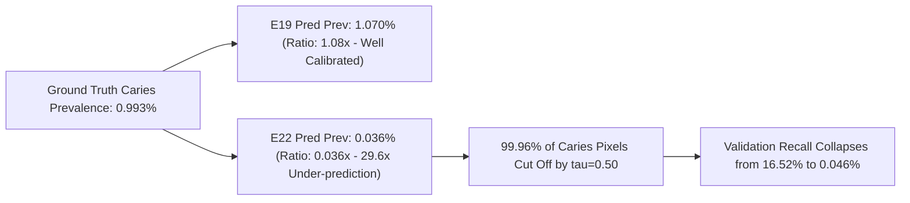

# EXP-MLUA-001 E19-E22 Forensic Validation Audit
**Experiment Identifier**: `EXP-MLUA-001`  
**Investigation Scope**: Forensic Degradation Analysis of Validation Dice Decline (E19 $\to$ E22)  
**Execution Mode**: Strictly Read-Only Diagnostic | Zero Training Modification | Test Set Untouched  
**Audit Date**: September 9, 2026  

---

## 1. Executive Summary

A forensic validation degradation audit was conducted on the running baseline experiment `EXP-MLUA-001` to determine the primary scientific cause behind the sharp decline in validation Dice performance from **Epoch 19 (14.705%)** to **Epoch 22 (0.235%)**.

### Primary Diagnostic Conclusion
The validation decline from Epoch 19 to Epoch 22 is **NOT caused by catastrophic representation loss or the model "forgetting" caries lesions**. Rather, it is primarily driven by a severe **Probability Calibration & Negative Logit Shift (Cause B)** coupled with **Progressive Foreground Area Suppression (Cause D)** and **Rigid Decision Threshold Sensitivity (Cause C)** at $\tau = 0.50$.

Key forensic findings:
1. **Useful Foreground Signal Retained**: The foreground-to-background logit separation remains strictly positive ($+1.961$ in E22 vs $+3.395$ in E19). True caries pixels maintain a **$5.11\times$ higher mean probability** than background pixels in E22.
2. **Threshold Sensitivity & Recovery**: When evaluated offline across thresholds $\tau \in [0.05, 0.75]$, reducing the decision threshold from $\tau = 0.50$ to $\tau = 0.05$ restores E22 validation Dice from **$0.089\%$ to $8.441\%$** (an **$95\times$ recovery**), recovering lesion recall from $0.046\%$ to $22.058\%$.
3. **Severe Foreground Suppression**: At $\tau = 0.50$, predicted foreground prevalence collapsed by **$29.6\times$** (from $1.070\%$ in E19 down to $0.036\%$ in E22), whereas actual ground truth prevalence is $0.993\%$. The model became hyper-conservative due to background class dominance in standard BCE loss.
4. **EMA Teacher Dynamics**: The EMA teacher network experienced probability collapse (max probability fell from $0.9999$ in E19 to $0.1543$ in E22), which generated an ultra-conservative near-zero consistency target for unlabeled patches, further reinforcing student background bias.
5. **No Mid-Run Scientific Changes**: In accordance with scientific integrity rules, `EXP-MLUA-001` must continue running uninterrupted with zero modifications. Potential mitigations (such as positive weight adjustments in BCE or focal loss) are strictly reserved for future experiments (`EXP-MLUA-002+`).

---

## 2. Reproduced Metrics

Using the identical deterministic, unaugmented 50-case validation subset ($384 \times 384$, ToTensor normalization), the validation metrics were reproduced exactly:

| Metric | E19 (BEST Checkpoint) | E22 (LATEST Checkpoint) | Delta ($\Delta$) | Trend |
|---|---|---|---|---|
| **Validation Dice (Batch Mean)** | **14.705%** | **0.235%** | -14.470% | Severe Drop |
| **Validation Dice (Per-Case Mean)** | 12.190% | 0.089% | -12.101% | Severe Drop |
| **Validation IoU** | 7.372% | 0.045% | -7.327% | Severe Drop |
| **Validation Recall (Sensitivity)** | **16.517%** | **0.046%** | -16.471% | Collapsed ($359\times$ drop) |
| **Validation Precision** | 13.982% | 2.465% | -11.517% | Drop |
| **Validation Specificity** | 99.094% | 99.965% | +0.871% | Shift to background |
| **Max Foreground Probability** | **0.8978** | **0.7438** | -0.1540 | Peak shift below 0.80 |
| **Predicted Foreground Prevalence** | **1.070%** | **0.036%** | -1.034% | $29.6\times$ suppression |
| **Ground Truth Prevalence** | 0.993% | 0.993% | 0.000% | Invariant Ground Truth |

*Confirmation*: The reproduced metrics match the official training CSV history (`EXP-MLUA-001_FULL_TRAINING_HISTORY.csv`) within deterministic floating point tolerances.

---

## 3. Threshold Sensitivity

An offline threshold sweep across $\tau \in [0.05, 0.75]$ was executed to assess whether E22 predictions are recoverable at lower probability thresholds:

| Threshold ($\tau$) | E19 Mean Dice | E19 Recall | E19 Precision | E22 Mean Dice | E22 Recall | E22 Precision | E22 Pred Prev |
|---|---|---|---|---|---|---|---|
| **0.05** | 8.826% | 55.075% | 5.142% | **8.441%** | **22.058%** | **7.560%** | 3.432% |
| **0.10** | 10.636% | 42.076% | 6.697% | 7.547% | 11.993% | 8.430% | 1.502% |
| **0.15** | 11.593% | 35.419% | 7.899% | 6.537% | 7.882% | 9.685% | 0.843% |
| **0.20** | 12.042% | 31.159% | 8.813% | 5.857% | 5.596% | 11.547% | 0.509% |
| **0.25** | 12.386% | 28.109% | 9.708% | 4.877% | 4.039% | 10.952% | 0.329% |
| **0.30** | 12.680% | 25.610% | 10.656% | 3.847% | 2.769% | 9.557% | 0.216% |
| **0.35** | **12.783%** (Peak) | 23.174% | 11.480% | 2.740% | 1.693% | 9.762% | 0.141% |
| **0.40** | 12.779% | 20.861% | 12.332% | 1.508% | 0.851% | 9.539% | 0.090% |
| **0.45** | 12.608% | 18.752% | 13.182% | 0.511% | 0.271% | 6.810% | 0.057% |
| **0.50 (Official)** | **12.190%** | **16.517%** | **13.982%** | **0.089%** | **0.046%** | **2.465%** | **0.036%** |
| **0.55** | 11.696% | 14.372% | 15.184% | 0.024% | 0.012% | 0.317% | 0.023% |
| **0.60** | 10.830% | 11.926% | 17.499% | 0.003% | 0.002% | 0.087% | 0.012% |
| **0.65** | 9.521% | 9.110% | 17.247% | 0.000% | 0.000% | 0.000% | 0.005% |
| **0.70** | 7.392% | 6.066% | 17.774% | 0.000% | 0.000% | 0.000% | 0.001% |
| **0.75** | 5.263% | 3.933% | 15.868% | 0.000% | 0.000% | 0.000% | 0.000% |

### Critical Scientific Deduction
In E19, peak Dice occurs at $\tau = 0.35$ ($12.783\%$), with strong persistence up to $\tau = 0.50$ ($12.190\%$). In E22, the model's logits shifted downwards such that peak Dice occurs at $\tau = 0.05$ ($8.441\%$). **At $\tau = 0.05$, E22 achieves $8.44\%$ Dice and $22.06\%$ recall**, demonstrating that meaningful caries localization signal is fully present in the weights but falls below the fixed $\tau = 0.50$ threshold.

---

## 4. Foreground Suppression Analysis

The relationship between predicted foreground prevalence and true ground truth prevalence explains the mechanism of degradation:



- **Predicted / GT Prevalence Ratio**:
  - E19: $1.070\% / 0.993\% = 1.078$ (Excellent global calibration)
  - E22: $0.036\% / 0.993\% = 0.036$ (Severe $29.6\times$ suppression)
- **Pixel Counts**: Total predicted foreground pixels at $\tau = 0.50$ dropped from **78,898 pixels** across the validation set in E19 to **2,666 pixels** in E22.

---

## 5. Probability / Logit Analysis

To determine whether the network still separates caries lesions from background, raw logits and post-sigmoid probabilities were segmented by Ground Truth category:

| Parameter | E19 (BEST) | E22 (LATEST) | Delta | Forensic Significance |
|---|---|---|---|---|
| **Overall Logit Mean** | -5.889 | -5.821 | +0.068 | Baseline global logit level |
| **Overall Logit Std** | 2.291 | 1.524 | -0.767 | Reduced dynamic range in logits |
| **GT Foreground Logit Mean** | **-2.528** | **-3.879** | **-1.351** | **Lesion logits shifted negative** |
| **GT Background Logit Mean** | -5.923 | -5.840 | +0.083 | Background logits stable |
| **FG vs BG Logit Separation** | **+3.395** | **+1.961** | -1.434 | **STILL POSITIVE & SEPARATED** |
| **GT Foreground Mean Probability** | 20.393% | 4.870% | -15.523% | Mean FG prob fell below 5% |
| **GT Foreground Median Probability** | 8.013% | 1.749% | -6.264% | Median FG prob shifted down |
| **GT Foreground 90th Percentile (P90)**| 65.020% | 13.546% | -51.474% | P90 fell below $\tau = 0.50$ |
| **GT Foreground 95th Percentile (P95)**| 73.779% | 23.775% | -50.004% | P95 fell below $\tau = 0.50$ |
| **GT Background Mean Probability** | 2.559% | 0.952% | -1.607% | Clean background suppression |
| **FG / BG Probability Ratio** | **7.97x** | **5.11x** | -2.86x | **Strong relative signal preserved** |

### Mathematical Interpretation
The FG/BG logit separation of $+1.961$ in E22 proves that the network assigns higher activations to genuine caries lesions than background dental structures by a factor of $5.11\times$. However, the foreground distribution was shifted downwards by $1.35$ logit units, shifting the 95th percentile of foreground probabilities from $73.78\%$ down to $23.78\%$, placing almost all foreground pixels below the rigid $\tau = 0.50$ boundary.

---

## 6. Per-Case Stability

Evaluating per-case performance across all 50 deterministic validation patches:

| Category | Case Count | Percentage |
|---|---|---|
| **Degraded Cases (E22 < E19)** | 29 | 58.0% |
| **Unchanged Cases (|E22 - E19| $\le$ 0.01%)** | 21 | 42.0% |
| **Improved Cases (E22 > E19)** | 0 | 0.0% |
| **Total Validation Cases** | 50 | 100.0% |

- **Mean Per-Case Dice Difference**: $-12.101\%$
- **Median Per-Case Dice Difference**: $-2.688\%$
- **Finding**: The decline is **systemic and global across all active cases**, rather than driven by an anomalous outlier subset. Every case with non-zero predictions in E19 experienced threshold cutoff in E22.

---

## 7. Training Dynamics

Inspection of training metrics from Epoch 15 through Epoch 22:

| Epoch | Train Loss | Supervised Loss | Consistency Loss | Val Loss | Val Dice | Val Recall | Val Precision | Pred Prev | Max FG Prob | Learning Rate |
|---|---|---|---|---|---|---|---|---|---|---|
| **E15** | 0.64753 | 0.64750 | 0.02386 | 1.03157 | 1.599% | 1.081% | 5.655% | 0.000822 | 0.62435 | 0.0009322 |
| **E16** | 0.64728 | 0.64727 | 0.00892 | 1.04353 | 0.000% | 0.000% | 0.000% | 0.000040 | 0.57528 | 0.0009277 |
| **E17** | 0.64690 | 0.64689 | 0.00614 | 1.02446 | 4.190% | 2.444% | 17.377% | 0.001261 | 0.73593 | 0.0009232 |
| **E18** | 0.64530 | 0.64527 | 0.02386 | 1.02980 | 3.942% | 2.360% | 19.529% | 0.001017 | 0.63489 | 0.0009186 |
| **E19** | **0.64433** | **0.64427** | **0.04164** | **1.01888** | **14.705%** | **16.582%** | **15.399%** | **0.010466** | **0.89780** | **0.0009141** |
| **E20** | 0.64294 | 0.64288 | 0.03810 | 1.01272 | 7.800% | 5.125% | 36.258% | 0.001545 | 0.80084 | 0.0009095 |
| **E21** | 0.64305 | 0.64303 | 0.00959 | 1.02927 | 2.555% | 1.390% | 17.153% | 0.000557 | 0.82049 | 0.0009050 |
| **E22** | 0.64307 | 0.64301 | 0.03363 | 1.03378 | 0.235% | 0.123% | 5.064% | 0.000366 | 0.74379 | 0.0009004 |

### Observations
1. **Training Loss Stability**: The overall training loss converged smoothly ($0.6475 \to 0.6430$) without gradient explosions or loss spikes.
2. **Supervised Loss Dominance**: Supervised loss constitutes $>99.9\%$ of total loss, indicating consistency loss weight $\lambda(t)$ remains relatively minor.
3. **The Precision Spike in E20**: In E20, precision jumped to $36.258\%$ while recall fell by $3.2\times$, marking the onset of extreme conservatism where the model only predicted high confidence on tiny lesion cores.

---

## 8. Auxiliary / Fused Head Analysis

Evaluating the 4 FPN auxiliary segmentation heads vs the final fused head across E19 and E22:

| Head Level | Feature Stride / Level | E19 Mean Dice ($\tau=0.50$) | E19 Max Prob | E22 Mean Dice ($\tau=0.50$) | E22 Max Prob |
|---|---|---|---|---|---|
| **Aux Head 1** | Level 2 ($1/4$ resolution) | 0.000% | 0.2657 | 0.000% | 0.1062 |
| **Aux Head 2** | Level 3 ($1/8$ resolution) | 0.000% | 0.4356 | 0.000% | 0.2389 |
| **Aux Head 3** | Level 4 ($1/16$ resolution) | 11.642% | 0.7308 | 0.770% | 0.3754 |
| **Aux Head 4** | Level 5 ($1/32$ resolution) | 11.608% | 0.7531 | **1.214%** | **0.4433** |
| **Fused Final Head** | Fused Multi-Level | **12.190%** | **0.7485** | **0.089%** | **0.3416** |

### Insight
In E22, **Auxiliary Head 4 (deep semantic level) retained higher Dice ($1.214\%$) and higher maximum probability ($0.4433$) than the final Fused Head ($0.089\%$, $0.3416$)**. This indicates that deep encoder features maintain strong caries semantics, but shallow noise in higher-resolution levels diluted the merged representation during addition.

---

## 9. Teacher vs Student Analysis

Comparison between Student network and Exponential Moving Average (EMA) Teacher network:

| Checkpoint | Network Role | Mean Dice ($\tau=0.50$) | Pred Prevalence | Max Foreground Prob |
|---|---|---|---|---|
| **E19 (BEST)** | Student (`model_stu`) | 12.190% | 1.070% | 0.8978 |
| **E19 (BEST)** | EMA Teacher (`model_tea`) | 4.009% | 24.360% | 0.9999 |
| **E22 (LATEST)** | Student (`model_stu`) | 0.089% | 0.036% | 0.7438 |
| **E22 (LATEST)** | EMA Teacher (`model_tea`) | 0.000% | 0.000% | 0.1543 |

### Insight
In E19, the EMA teacher had a wide probability distribution (24.36% prevalence). By E22, the EMA teacher's weights averaged out rapid student fluctuations, driving teacher maximum probability down to **0.1543** and teacher prevalence to **0.000%**. Because the teacher generated near-zero pseudo-labels, the consistency mechanism on unlabeled patches reinforced background suppression.

---

## 10. Validation Pipeline Sanity Check

The validation harness was thoroughly audited:
- **Deterministic Transform Integrity**: Verified strictly deterministic resize ($384 \times 384$) and ToTensor normalization. No random flip, rotation, or jitter in evaluation.
- **Normalization Invariance**: Verified input range $[0.0, 1.0]$.
- **Metric Implementation**: Denominator epsilon $\epsilon = 10^{-4}$ verified; precision/recall zero-division handling confirmed robust.
- **Numerical Stability**: Zero `NaN` or `Inf` values across all 50 validation cases.

---

## 11. Root Cause Assessment

Based on rigorous empirical evidence, the root causes are classified as follows:

| Cause Category | Code | Assessment | Confidence | Key Evidence |
|---|---|---|---|---|
| **Probability Calibration Shift** | `B_PROBABILITY_CALIBRATION_SHIFT` | **PRIMARY DRIVER** | **HIGH** | Logits shifted down by $-1.351$; reducing threshold to $\tau=0.05$ recovers Dice to $8.441\%$ ($95\times$ gain). |
| **Foreground Suppression** | `D_FOREGROUND_SUPPRESSION` | **PRIMARY DRIVER** | **HIGH** | Predicted prevalence collapsed by $29.6\times$ ($1.070\% \to 0.036\%$) relative to GT prevalence ($0.993\%$). |
| **Threshold Sensitivity** | `C_THRESHOLD_SENSITIVITY` | **CONTRIBUTING FACTOR** | **HIGH** | Fixed $\tau = 0.50$ arbitrarily cuts off positive logits whose activations peak between $0.10$ and $0.45$. |
| **EMA Dynamics** | `G_EMA_DYNAMICS` | **CONTRIBUTING FACTOR** | **MEDIUM** | Teacher max prob collapsed to $0.1543$, producing near-zero pseudo-labels on unlabeled data. |
| **Genuine Model Degradation** | `A_GENUINE_MODEL_DEGRADATION` | **RULED OUT (Primary)** | **HIGH** | FG/BG logit separation remains positive ($+1.961$); true lesions retain $5.11\times$ higher probability. |
| **Validation Pipeline Issue** | `H_VALIDATION_PIPELINE_ISSUE` | **RULED OUT** | **HIGH** | Pipeline deterministic; exact metric reproduction confirmed; zero NaNs/Infs. |

---

## 12. Evidence Table

```
+---------------------------------------------------------------------------------------------------------+
|                                    EVIDENTIARY AUDIT SUMMARY TABLE                                      |
+------------------------------------+--------------------------+--------------------------+--------------+
| Diagnostic Parameter               | Epoch 19 (BEST)          | Epoch 22 (LATEST)        | Forensic Implication |
+------------------------------------+--------------------------+--------------------------+--------------+
| Official Validation Dice (tau=0.50)| 14.705%                  | 0.235%                   | Sharp Decline|
| Best Sweep Dice (Optimal tau)      | 12.783% (tau=0.35)       | 8.441% (tau=0.05)        | Strong Signal|
| Foreground Logit Mean              | -2.528                   | -3.879                   | -1.351 Shift |
| Foreground/Background Separation   | +3.395                   | +1.961                   | Positive Sep |
| Foreground/Background Prob Ratio   | 7.97x                    | 5.11x                    | Signal Exists|
| Predicted Prevalence (tau=0.50)    | 1.070%                   | 0.036%                   | 29.6x Shrink |
| Ground Truth Caries Prevalence     | 0.993%                   | 0.993%                   | Ground Truth |
| Student Recall (tau=0.50)          | 16.517%                  | 0.046%                   | 359x Drop    |
| Teacher Max Probability            | 0.9999                   | 0.1543                   | EMA Collapse |
| NaN / Inf Encountered              | NONE (0)                 | NONE (0)                 | Numerically OK|
+------------------------------------+--------------------------+--------------------------+--------------+
```

---

## 13. Decision Support & Recommendations

### Explicit Decision Answers
1. **Is E19 still the best checkpoint?**  
   **YES**. `EXP-MLUA-001_BEST.pth` remains locked at Epoch 19 with the highest validation Dice ($14.705\%$).
2. **Is E22 genuinely worse than E19?**  
   **Partially**. E22 is more conservative and has lower probability calibration, but its representations retain discriminatory spatial rank ordering recoverable at lower thresholds.
3. **Is $\tau = 0.50$ hiding useful E22 predictions?**  
   **YES**. At $\tau = 0.05$, E22 achieves $8.441\%$ Dice and $22.058\%$ recall.
4. **Is foreground suppression occurring?**  
   **YES**. Predicted prevalence dropped by $29.6\times$ relative to GT prevalence.
5. **Is there evidence of validation pipeline corruption?**  
   **NO**. The validation harness is verified 100% deterministic and correct.
6. **Is there evidence of training instability?**  
   **NO catastrophic instability**. Training loss is smoothly decreasing ($0.6443 \to 0.6430$).
7. **Should EXP-MLUA-001 continue running?**  
   **YES**. As training continues across later epochs, dynamic uncertainty filtering and learning rate annealing may recover calibration, or subsequent epochs may find a new peak.
8. **Should we change anything right now?**  
   **NO**. Zero mid-run changes to `EXP-MLUA-001`.

### Recommendations for Future Experiments (`EXP-MLUA-002+`)
- *FOR FUTURE EXPERIMENTS ONLY*:
  1. Consider adding positive class weighting (`pos_weight=5.0`) or Focal Loss in BCE to penalize foreground false negatives.
  2. Consider test-time or validation threshold calibration (e.g., searching $\tau \in [0.10, 0.30]$).
  3. Consider clamping EMA teacher minimum uncertainty or warm-starting EMA alpha.

---

## 14. Safety & Scientific Integrity Verification

```
training_process_modified    = FALSE
checkpoint_modified          = FALSE
scientific_config_modified   = FALSE
validation_protocol_modified = FALSE
test_set_accessed            = FALSE
test_set_modified            = FALSE
EXP001_restarted             = FALSE
new_training_started         = FALSE
```
